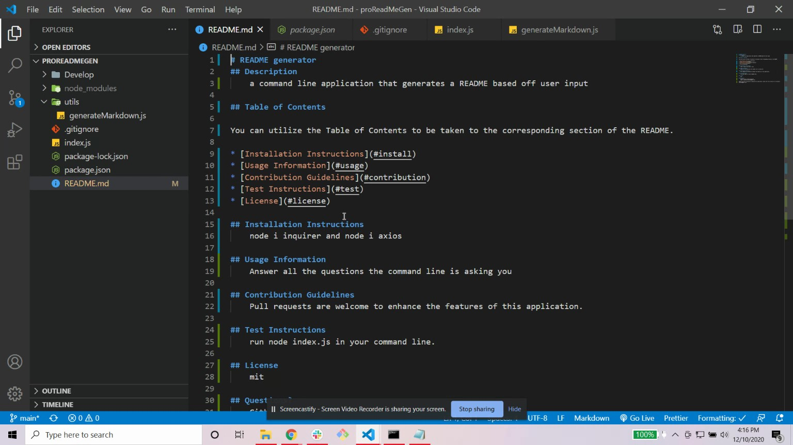

# proReadMeGen

## Description

The purpose of this command line application is to dynamically generate a professional README.md

file utlizing the user's input with the inquirer package. By doing so, it allows software

developers to focus more on their projects, and less on making professional README's! To invoke this

command line applications; simply use node index.js.

## Installation

Use the package manager's [inquirer](https://www.npmjs.com/package/inquirer) and [axios](https://www.npmjs.com/package/axios) to install this application.

node i inquirer
node i axios

[video link](https://drive.google.com/file/d/1H__u1tlCO2zFJSqFmaX7oRgCvOBPkJWW/view)
![command] (./img/commandline.jpg)

## License

[MIT](https://choosealicense.com/licenses/mit/)
